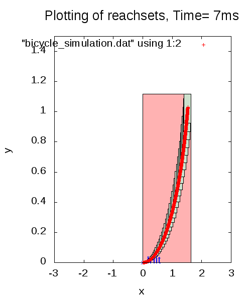
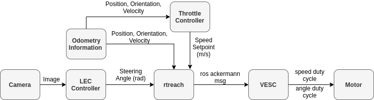
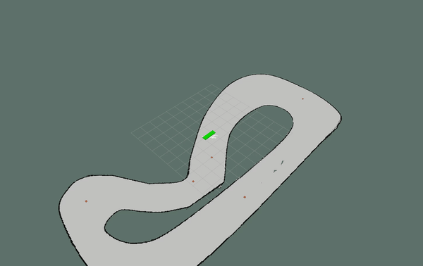

# F1Tenth Rtreach


# Table of Contents

1. [Introduction](#introduction)
2. [Multi-Agent Reachability](#MultiAgent)
3. [Docker](#Docker)
4. [Repositiory Organization](#CodeDescrip)

### Real Time Reachability for the F1Tenth Platform  <a name="introduction"></a>

This repo is an implementation of a runtime assurance approach by [Stanley Bak et al.](https://ieeexplore.ieee.org/document/7010482) for the F1Tenth platform. The motivation for runtime assurance stems from the ever-increasing complexity of software needed to control autonomous systems, and the need for these systems to be certified for safety and correctness. Thus the methods contained herein are used to build monitors for the system that can be used to ensure that the system remains within a safe operating mode. As an example, in the following animations we display a system with an unsafe neural network inspired controller that occasionally causes the f1tenth model to crash into walls. In the second animation, we add a real time safety monitor that switches to a safe controller when it detects a potential collision. Though the safety controller sacrifices performance it ensures that we do not collide with obstacles. The safety monitor was designed using the algorithms described by Bak et al. 


#### Neural Network Only (LEC)


#### Neural Network + Monitor + Safety Controller


**Disclaimer**: Our assumption is that you are using linux. A major part of this effort involves ROS. This code was tested on a computer running Ubuntu 16.04.6 LTS.

### Intro to rtreach: Let's start with an example.
<hr /> 

The safey monitor implemented in this repository relies on an anytime real-time reachability algorithm based on [mixed face-lifting](http://www.taylortjohnson.com/research/bak2014rtss.pdf). The reach-sets obtained using this method are represented as hyper-rectangles and we utilize these reachsets to check for collisons with obstacles in the vehicle's environment. The following example shows the use of this algorithm to check whether the vehicle will enter an unsafe operating mode in the next one second using the current control command. 

### Before we continue let's first compile the example code by executing the following: 
<hr /> 

```
$ cd src/
$ gcc -std=gnu99 -O3 -Wall  face_lift_bicycle_model.c geometry.c interval.c simulate_bicycle.c util.c  dynamics_bicycle_model.c  bicycle_safety.c main.c bicycle_model.c  -lm -o bicycle 
```
In this example, our vehicle is at the origin (x = 0, y = 0) with a current heading of 0 radians and an initial linear velocity of 0 m/s. The current control command being considered issues a speed set point of 1 m/s and a steering angle of 0.266 radians. Executing the code below will print whether or not the vehicle will enter an unsafe state. The alloted time that we have specified for reachability computations is 100ms. Since our technique is anytime it refines the precision of the reachability computation based on available runtime by halving the step size used in the face-lifting technique.

### Run a one second simulation using the following command
<hr /> 

```
$ ./bicycle 100 0.0 0.0 0.0 0.0 1.0 0.2666
```

Expected output: 
```
runtime: 100 ms
x_0[0]: 0.000000
x_0[1]: 0.000000
x_0[2]: 0.000000
x_0[3]: 0.000000
u_0[0]: 1.000000
u_0[1]: 0.266600

Quitting simulation: time: 2.020000, stepSize: 0.020000
If you keep the same input for the next 2.000000 s, the state will be: 
 [1.545528,1.046166,1.283163,1.203507] 

Opening file...with 5536 points
offending cone (1.500000,2.500000) (1.500000, 2.500000)
unsafe....
Quitting from runtime maxed out
[HyperRectangle (1.527867, 1.529682) (1.032242, 1.033770) (1.280197, 1.280286) (1.188098, 1.188847)]
133ms: stepSize = 0.000391
iterations at quit: 10
done, result = safe
Done
```
As we can see our initial computation identified a collision with a cone in the vehicle's environment but by refining the reachset in successive iterations of the reachability computation, it becomes clear that this warning is spurious. 

### Plotting of Reachsets
<hr /> 

We can visualize the results of the above example by executing the following: 

```
$ gcc -std=gnu99 -O3 -Wall  face_lift_bicycle_model_visualization.c geometry.c interval.c simulate_bicycle_plots.c util.c  dynamics_bicycle_model.c  bicycle_plots_main.c bicycle_model_plots.c -lm -o bicycle_plot
```

 and then: 

```
$ ./bicycle_plot 100 2.0 0.0 0.0 0.0 0.0 1.0 0.2666
``` 

Finally, (assuming you have [gnuplot](http://gausssum.sourceforge.net/DocBook/ch01s03.html)), you can visualize the results by running: 
```
 $ gnuplot < plot_bicycle.gnuplot
```
Usage of plotting utilities: 

```
$ ./bicycle_plot (milliseconds-runtime) (seconds-reachtime) (x) (y) (linear velocity) (heading) (throttle control input) (heading control input)
```



In the above image, the green rectangles are the intermediate reachable sets encountered after each face-lifting operation, and the red rectangle is the convex hull of these rectangles.

### Building rtreach as a C library. 
<hr /> 

Now that you have a taste of what rtreach is, we can move on to the more fun part. Using rtreach within ROS. By doing this, we can implement a safety monitor using the archtichture displayed again below: 



First compile the code and create the rospackage, credit: [mix-c-and-cpp](https://www.thegeekstuff.com/2013/01/mix-c-and-cpp/):

```
$ cd src
$ gcc -c -std=gnu99 -O3 -Wall  -fpic face_lift_bicycle_model.c geometry.c interval.c simulate_bicycle.c util.c  dynamics_bicycle_model.c bicycle_safety.c bicycle_model.c face_lift_bicycle_model_visualization.c bicycle_model_vis.c bicycle_dynamic_safety.c bicycle_model_dynamic_vis.c -lm
```

Next create a shared library:

```
$ gcc -shared -o libRtreach.so face_lift_bicycle_model.o bicycle_model.o dynamics_bicycle_model.o geometry.o interval.o  simulate_bicycle.o util.o bicycle_safety.o 
```

This will create a file called **libRtreach.so**. 

Let's compile a test to make sure everything worked correctly.

```
$ g++ -L$(pwd)/ -Wall test.cpp -o test -lRtreach
```

Before running the executable make sure that the path of shared library is contain in the environment variable LD_LIBRARY_PATH.

```
$ export LD_LIBRARY_PATH=$(pwd):$LD_LIBRARY_PATH
$ ./test
``` 

The output of the test should be:

```
Quitting simulation: time: 2.020000, stepSize: 0.020000
If you keep the same input for the next 2.000000 s, the state will be: 
 [1.931151,0.000000,1.249570,0.000000] 
```

If that test worked, smile, take a breath and let's have some fun with ROS. If not feel free to send me an [email](mailto:patrick.musau@vanderbilt.edu) and we will see what we can do. 

### Using rtreach with the F1Tenth Simulator
<hr /> 

The platform that we seek to use these techniques on is a 1/10 scale autonomous race car named the [F1Tenth](https://f1tenth.org/). The platform was inspired as an international competition for researchers, engineers, and autonomous systems enthusiasts originally founded ath University of Pennsylvania in 2016. Our initial implmentation is done in simulation but we are also planning on doing this on the hardware platform. Thus, This assumes that you have the F1Tenth Simulator installed. If not please install it by following the instructions available [here](https://github.com/pmusau17/Platooning-F1Tenth).

### Overlaying worskpaces
<hr /> 
Once that is installed. You have to add the setup script to your ~/.bashrc file. This allows you to [overlay workspaces](http://wiki.ros.org/catkin/Tutorials/workspace_overlaying). Using your favourite editor add the following line to your ~/.bashrc. I like gedit or nano (vim lovers just relax). 

```
gedit ~/.bashrc
```
add this to the bottom of that file

```
source /path/to/Platooning-F1Tenth/setup.bash
```

**change the path above to reflect the one on your machine**.


Then run 
```
$ source ~/.bashrc
```

You're now all set to build rtreach. In the rtreach_f1tenth/ folder run the following: 

```
$ ./build_rtreach.sh
```

This will create a ros package called rtreach_ros in the directory above this one. Run the following command to use the package

```
cd ../rtreach_ros && source devel/setup.bash
```

### Running Rtreach
<hr /> 

In the Platooning-F1Tenth ros package execute the following: 

```
$ source devel/setup.bash
```


Then start the simulation. This will bring up the track displayed at the start of this readme and a green model of a simplistic autonomous vehicle. 

```
$ roslaunch race sim_for_rtreach.launch 
```

The neural network inspired controller that we use in our experiments maps images captured from the vehicle's camera into one of five discrete actions (turn left, turn right, continue straight, turn weakly left, turn weakly right). The network model used to make inferences is [VGG-7](https://towardsdatascience.com/only-numpy-implementing-mini-vgg-vgg-7-and-softmax-layer-with-interactive-code-8994719bcca8). The safe controller is a gap following algorithm that we select because of its ability to avoid obstacles. 


Run the safety monitor + safety_controller + neural network controller. 

```
$ rosrun rtreach reach_node porto_obstacles.txt
```
In this setup the decision manager will allow the neural network model to control the vehicle so long as the control command issue will not cause the vehicle to enter an unsafe state in the next one second. Otherwise the safety controller will be used. The decision manager can then return to the neural network controller provided that the car has been in a safe operating mode for 20 control steps. 


To select a different set of weights for the neural network, you can specify the model .hdf5 in the [rtreach.launch](https://github.com/pmusau17/Platooning-F1Tenth/blob/master/src/race/launch/rtreach.launch) file. The available .hdf5 files are listed in the following [directory](https://github.com/pmusau17/Platooning-F1Tenth/tree/master/src/computer_vision/models). You are also free to train your own!

Arguments that can be provided to the [sim_for_rtreach launch file](https://github.com/pmusau17/Platooning-F1Tenth/blob/master/src/race/launch/sim_for_rtreach.launch): 
- world_name: gazebo world file used to generate environment.
- model_name: network .hdf5 keras model file. 
- csv_filename: waypoint file used by pure pursuit algorithm.
- lec_only: flag that limits experiment to LEC only control.
- map_file: occupancy grid for corresponding world name. 
- random_seed: random seed used to allocte obstacles within vehicle environment.
- freespace_file: free space points within occupancy grid this file is generate by [gen_map.py](https://github.com/pmusau17/Platooning-F1Tenth/blob/master/src/race/scripts/gen_map.py)
- timeout: how long to run each experiment before timeout.

Example specification of argument parameter: **argument_name:=value** 

```
$ roslaunch race sim_for_rtreach.launch timeout:=10 
```

### Visualizing the Reachable Set
<hr /> 

You can visualize the reachable set by running the following: 

```
$ rosrun rtreach visualize_node porto_obstacles.txt 1 2.0 10
```

Usage: 

```
$ rosrun rtreach visualize_node (file containing obstacle locations) (boolean for bloating of reachset) (reachset time horizon) (reachability wall time)
```




### Run Benchmarking Series of Experiments
<hr /> 

One of the things that may be useful to do is to run a series of simulations with a diverse number of obstacle placements for a given track. Then one can monitor how effective the safety controller under consideration is. We have made this functionality available. The bash script [run_batch.sh](run_batch.sh) performs several experiments with a timeout of 60 seconds and randomly places obstacles within the racetrack.

To use the script first source both the rtreach and Platooning-F1Tenth packages and then run the bash file:

#### End-to-End Controller Experiments 
```
$ source rtreach_ros/devel/setup.bash
$ source Platooning-F1Tenth/devel/setup.bash
$ ./run_batch.sh
```

#### Reinforcement Learning Experiments
```
$ source rtreach_ros/devel/setup.bash
$ source Platooning-F1Tenth/devel/setup.bash
$ ./run_batch_rl.sh
```

If a collision occurs during any of the experiments it will be logged along with the random_seed, and number of obstacles so that the scenario can be re-produced. The logs can be found in the following [directory](https://github.com/pmusau17/Platooning-F1Tenth/blob/master/src/race/logs).


# Docker <a name="Docker"></a>

[NVIDIA-Docker](https://github.com/NVIDIA/nvidia-docker) is a requirement for running dockerized. If it is not installed run the following:

```
$ distribution=$(. /etc/os-release;echo $ID$VERSION_ID)
$ curl -s -L https://nvidia.github.io/nvidia-docker/gpgkey | sudo apt-key add -
$ curl -s -L https://nvidia.github.io/nvidia-docker/$distribution/nvidia-docker.list | sudo tee /etc/apt/sources.list.d/nvidia-docker.list
$ sudo apt-get update && sudo apt-get install -y nvidia-docker2
$ sudo systemctl restart docker
```
Once that is installed use the [build_docker.sh] file to build the docker images:

```
$ ./build_docker.sh
```

This should take about 10-15 minutes.

In order to  enable the use of graphical user interfaces within Docker containers such as Gazebo and Rviz give docker the rights to access the X-Server with:

```bash
$ xhost +local:docker
``` 

This command allows one to connect a container to a host's X server for display **but it is not secure.** It compromises the access control to X server on your host. So with a little effort, someone could display something on your screen, capture user input, in addition to making it easier to exploit other vulnerabilities that might exist in X.
 
**So When you are done run :** 

```bash
$ xhost -local:docker
``` 

### Starting the Simulation: 
<hr /> 

To start the simuation run: 

```
$ docker container run --runtime=nvidia -it -e DISPLAY  --rm --net=host --env="QT_X11_NO_MITSHM=1" -v /tmp/.X11-unix:/tmp/.X11-unix simulator
```

Once gazebo and rviz have completed their startup, in a seperate terminal run: 

```
docker container run -it --name=rtreach_ntainer  --rm --net=host rtreach
```

### Computing Reachsets for Dynamic Obstacles
<hr /> 

The obstacle tracking problem is a well studied and challenging topic within the autonomous vehicle, computer vision, and robotics literature. 
Typically some assumptions are required in order to constrain the tracking problem to best suit the context of the application. In our framework we assumed that the obstacles could be described a two dimensional kinematic model and a corresponding bounding box. The code below implements reachability using this model

```
$ gcc -std=gnu99 -Wall face_lift_obstacle.c geometry.c interval.c util.c  simulate_obstacle.c dynamics_obstacle.c main_obstacle.c obstacle_model.c -lm -o obstacle -DOBSTACLE_MODEL
```

```
./obstacle 10 0 0 1.0 0.0
```

### Obstacle Visualization
<hr /> 

To visualize the reachsets using a two-dimensional kinematic model: 

```
$ gcc -std=gnu99 -Wall face_lift_obstacle_visualization.c geometry.c interval.c util.c  simulate_obstacle.c  dynamics_obstacle.c  main_obstacle_vis.c obstacle_model_plots.c -lm -o obstacle_plot -DOBSTACLE_MODEL
```

```
./obstacle_plot 5 0 0 1.0 0.1
```

### Using the kinematic model within the simulator. 
<hr /> 

As an example, if we assume that the F1Tenth model can be described by a two-dimensional kinematic model, then the reachability analysis code takes the following form: 

In two seperate terminals run the following: 

**Make sure to source PlatooningF1Tenth/devel/setup.bash**

Terminal 1:
```
roslaunch race sim_for_rtreach.launch
```

**Make sure to source rtreach_ros/devel/setup.bash**

Terminal 2: 
```
rosrun rtreach visualize_obs racecar 1.0 2.0 100
```


# Multi-Agent Reachability<a name="MultiAgent"></a>


To enable reachability regimes within the context of dynamic obstacles and multiple agents we need a way to send the hyper-rectangles on the ROS network. Additionally we need to set an upper limit on the number of hyper-rectangles used to represent the reachable set. This is what the following code implements.

To launch such a simulation run the following

```
$ source rtreach_ros/devel/setup.bash
$ source Platooning-F1Tenth/devel/setup.bash
$ roslaunch race sim_for_rtreach_multi_agent.launch
```

Multi-agent nodes

```
rosrun rtreach reach_node_dyn 1.0 2.0 100 1
rosrun rtreach vis_node_param 1.0 2.0 100 1
```

### Running the Multi-Agent Experiments in Docker

To run the multi-agent experiments, open two terminals and run the following: 

```
./docker/launch_docker_sim.sh
```

To change the number of vehicles open the above bash script and change number of cars from 2 to 3.

In the second terminal run: 

```
./docker/launch_multi_agent.sh
```

# Repository Organization <a name="CodeDescrip"></a>
**ros_src/rtreach:** ros-package containing rtreach implementation.
- [reach_node_sync.cpp](ros_src/rtreach/src/reach_node_sync.cpp): ROS-node implementation of safety monitor and controller. 
- [visualize_reachset.cpp](ros_src/rtreach/src/visualize_reachset.cpp): ROS-node for visualization of hyper-rectangles.

**src:** C-implementation of rtreach.
- [dynamics_bicycle_model.c](src/dynamics_bicycle_model.c): Interval arithmetic implementation of a kinematic bicycle model for a car. Parameters are identified using [grey-box system identification](https://github.com/pmusau17/Platooning-F1Tenth/tree/master/src/race/sys_id).
- [interval.c](src/interval.c): Implementation of interval arithmetic methods.
- [geometry.c](src/geometry.c): Implementation of hyper-rectangle methods.
- [face_lift_bicycle_model.c](src/face_lift_bicycle_model.c): Facelifting method implementation with bicycle model dynamics.
- [bicycle_safety.c](src/bicycle_safety.c): Implementation of safety checking for the f1tenth model. Current checking includes static obstacles and collisions with walls.
- [simulate_bicycle.c](src/simulate_bicycle.c): Implementation of Euler simulation of kinematic bicycle model. 
- [simulate_bicycle_plots.c](src/simulate_bicycle_plots.c): Implementation of methods for plotting for reach sets.
- [bicycle_model.c](src/bicycle_model.c): Implementation of safety checking for f1tenth platform, makes use of the facelifting algorithms in [face_lift_bicycle_model.c](src/face_lift_bicycle_model.c).
- [bicycle_model_plots.c](src/bicycle_model_plots.c): Same as above but intented for plotting purposes.
- [util.c](src/util.c): Helper functions for timing and printing. 


